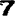

```{r setup, include=FALSE}
library(readr)
library(plyr)
library(dplyr)
library(tidyr)
library(knitr)
library(reticulate)
library(stringr)
library(caret)
library(class)
library(protoclass)
opts_chunk$set(echo = TRUE)
knit_engines$set(python = eng_python)
py_install("numpy")
py_install("pandas")
py_install("Pillow")
py_install("matplotlib")
```

```{python}
import numpy as np
import pandas as pd
from PIL import Image
import matplotlib.pyplot as plt
```

# STA 211: Entreposage et fouille de données - Projet - Présentation du code

## Introduction

Ce document présente une synthèse commenté d'une partie du code que j'ai utilisé pour la rédaction du projet de l'UE STA 211: Entreposage et fouille de données.

L'intégralité du code ce trouve sur ce dépôt Git, avec le suivi des versions: [DigitRecognizer](https://github.com/bemayer/DigitRecognizer), mais tout n'est peut être pas digne de l'intérêt du correcteur.

## Analyse des données

### Chargement des données

Pour rendre ce R Markdown exécutable sans modification lors de la correction, les données sont chargées depuis un hébergement en ligne.

```{r}
data_test <- read_csv("https://raw.githubusercontent.com/bemayer/DigitRecognizer/master/Keras/Data/data_test.csv")
data_train <- read_csv("https://raw.githubusercontent.com/bemayer/DigitRecognizer/master/Keras/Data/data_train.csv")
data_train["class"] <- as.factor(make.names(data_train[["class"]]))
head(data_train["class"])
```

Comme indiqué dans la note préliminaire de mon rapport, j'ai récupéré la classe de chaque individu du fichier data_test pour pouvoir l'utiliser comme mon échantillon de test.

```{r}
mfeat_pix <- read_delim("https://archive.ics.uci.edu/ml/machine-learning-databases/mfeat/mfeat-pix", delim = "  ", col_names = FALSE, trim_ws=TRUE) %>% unite(image, sep = "") %>% cbind(digit = rep(0:9, each=200))
data_test["class"] <- data_test %>% unite(image, 363:602, sep = "") %>% select(image) %>% join(mfeat_pix, by="image", type="left", match="first") %>% select(digit)
data_test["class"] <- as.factor(make.names(data_test[["class"]]))
head(data_test["class"])
```

### Visualisation des données

Pour visualiser les données, j'ai créé les scripts suivants, qui permettent de générer une image d'un chiffre ainsi qu'un tableau en LaTeX de chacun des pixels:

```{python}
# ------------------------------------------------------------------------------
# Data
data_train = pd.read_csv('https://raw.githubusercontent.com/bemayer/DigitRecognizer/master/Keras/Data/data_train.csv')
pix = data_train.filter(regex=('pix*'))
# ------------------------------------------------------------------------------


# ------------------------------------------------------------------------------
# Image output
line = 1185
palette_RGB = [[int(255-x*255/6)]*3 for x in range(7)]
image_RGB = np.array([[palette_RGB[pix.iloc[line, i+15*j]] 
			for i in range(15)] for j in range(16)], dtype=np.uint8)
image = Image.fromarray(image_RGB)
image.save("image_1185.png")
# ------------------------------------------------------------------------------


# ------------------------------------------------------------------------------
# Latex ouput - one case

print('\\begin{array}{ccccccccccccccc}')
for j in range(16):
	for i in range(15):
		print('\cellcolor[RGB]{',
			str(int(255 - 128*pix.iloc[line, i+15*j]/6)), ', ',
			str(int(255 - 128*pix.iloc[line, i+15*j]/6)), ', ',
			str(int(255 - 128*pix.iloc[line, i+15*j]/6)), '} ',
			pix.iloc[line, i+15*j],
			sep='', end='')
		if i != 14:
			print(' & ', end='')
	if (j != 15):
		print(' \\\\', end='')
	print()
print('\\end{array}')
# ------------------------------------------------------------------------------


# ------------------------------------------------------------------------------
# Latex ouput - average off all columns
pix_avg = pix.mean()
print('\\begin{array}{ccccccccccccccc}')
for j in range(16):
	for i in range(15):
		print('\cellcolor[RGB]{', str(int(255 - 128*pix_avg[i+15*j]/6)), ', ',
			str(int(255 - 128*pix_avg[i+15*j]/6)), ', ',
			str(int(255 - 128*pix_avg[i+15*j]/6)), '} ',
			round(pix_avg[i+15*j], 1),
			sep='', end='')
		if i != 14:
			print(' & ', end='')
	if (j != 15):
		print(' \\\\', end='')
	print()
print('\\end{array}')
# ------------------------------------------------------------------------------
```

Voici l'image et le rendu LaTeX du tableau des pixels pour un même chiffre, ainsi que le tableau des valeurs moyennes des pixels pour tout le fichier data_train.

```{r}

```

```{=latex}
\begin{array}{ccccccccccccccc}
\cellcolor[RGB]{233, 233, 233} 1 & \cellcolor[RGB]{169, 169, 169} 4 & \cellcolor[RGB]{169, 169, 169} 4 & \cellcolor[RGB]{169, 169, 169} 4 & \cellcolor[RGB]{169, 169, 169} 4 & \cellcolor[RGB]{169, 169, 169} 4 & \cellcolor[RGB]{169, 169, 169} 4 & \cellcolor[RGB]{169, 169, 169} 4 & \cellcolor[RGB]{169, 169, 169} 4 & \cellcolor[RGB]{169, 169, 169} 4 & \cellcolor[RGB]{169, 169, 169} 4 & \cellcolor[RGB]{148, 148, 148} 5 & \cellcolor[RGB]{148, 148, 148} 5 & \cellcolor[RGB]{169, 169, 169} 4 & \cellcolor[RGB]{233, 233, 233} 1 \\
\cellcolor[RGB]{127, 127, 127} 6 & \cellcolor[RGB]{127, 127, 127} 6 & \cellcolor[RGB]{127, 127, 127} 6 & \cellcolor[RGB]{127, 127, 127} 6 & \cellcolor[RGB]{127, 127, 127} 6 & \cellcolor[RGB]{127, 127, 127} 6 & \cellcolor[RGB]{127, 127, 127} 6 & \cellcolor[RGB]{127, 127, 127} 6 & \cellcolor[RGB]{127, 127, 127} 6 & \cellcolor[RGB]{127, 127, 127} 6 & \cellcolor[RGB]{127, 127, 127} 6 & \cellcolor[RGB]{127, 127, 127} 6 & \cellcolor[RGB]{127, 127, 127} 6 & \cellcolor[RGB]{127, 127, 127} 6 & \cellcolor[RGB]{148, 148, 148} 5 \\
\cellcolor[RGB]{191, 191, 191} 3 & \cellcolor[RGB]{169, 169, 169} 4 & \cellcolor[RGB]{169, 169, 169} 4 & \cellcolor[RGB]{127, 127, 127} 6 & \cellcolor[RGB]{169, 169, 169} 4 & \cellcolor[RGB]{212, 212, 212} 2 & \cellcolor[RGB]{212, 212, 212} 2 & \cellcolor[RGB]{212, 212, 212} 2 & \cellcolor[RGB]{148, 148, 148} 5 & \cellcolor[RGB]{127, 127, 127} 6 & \cellcolor[RGB]{127, 127, 127} 6 & \cellcolor[RGB]{127, 127, 127} 6 & \cellcolor[RGB]{127, 127, 127} 6 & \cellcolor[RGB]{127, 127, 127} 6 & \cellcolor[RGB]{169, 169, 169} 4 \\
\cellcolor[RGB]{169, 169, 169} 4 & \cellcolor[RGB]{191, 191, 191} 3 & \cellcolor[RGB]{255, 255, 255} 0 & \cellcolor[RGB]{255, 255, 255} 0 & \cellcolor[RGB]{255, 255, 255} 0 & \cellcolor[RGB]{255, 255, 255} 0 & \cellcolor[RGB]{255, 255, 255} 0 & \cellcolor[RGB]{255, 255, 255} 0 & \cellcolor[RGB]{255, 255, 255} 0 & \cellcolor[RGB]{127, 127, 127} 6 & \cellcolor[RGB]{127, 127, 127} 6 & \cellcolor[RGB]{127, 127, 127} 6 & \cellcolor[RGB]{127, 127, 127} 6 & \cellcolor[RGB]{127, 127, 127} 6 & \cellcolor[RGB]{212, 212, 212} 2 \\
\cellcolor[RGB]{148, 148, 148} 5 & \cellcolor[RGB]{127, 127, 127} 6 & \cellcolor[RGB]{148, 148, 148} 5 & \cellcolor[RGB]{255, 255, 255} 0 & \cellcolor[RGB]{255, 255, 255} 0 & \cellcolor[RGB]{255, 255, 255} 0 & \cellcolor[RGB]{255, 255, 255} 0 & \cellcolor[RGB]{255, 255, 255} 0 & \cellcolor[RGB]{212, 212, 212} 2 & \cellcolor[RGB]{127, 127, 127} 6 & \cellcolor[RGB]{127, 127, 127} 6 & \cellcolor[RGB]{127, 127, 127} 6 & \cellcolor[RGB]{127, 127, 127} 6 & \cellcolor[RGB]{233, 233, 233} 1 & \cellcolor[RGB]{255, 255, 255} 0 \\
\cellcolor[RGB]{255, 255, 255} 0 & \cellcolor[RGB]{212, 212, 212} 2 & \cellcolor[RGB]{212, 212, 212} 2 & \cellcolor[RGB]{255, 255, 255} 0 & \cellcolor[RGB]{255, 255, 255} 0 & \cellcolor[RGB]{255, 255, 255} 0 & \cellcolor[RGB]{255, 255, 255} 0 & \cellcolor[RGB]{191, 191, 191} 3 & \cellcolor[RGB]{127, 127, 127} 6 & \cellcolor[RGB]{127, 127, 127} 6 & \cellcolor[RGB]{127, 127, 127} 6 & \cellcolor[RGB]{127, 127, 127} 6 & \cellcolor[RGB]{191, 191, 191} 3 & \cellcolor[RGB]{255, 255, 255} 0 & \cellcolor[RGB]{255, 255, 255} 0 \\
\cellcolor[RGB]{255, 255, 255} 0 & \cellcolor[RGB]{255, 255, 255} 0 & \cellcolor[RGB]{255, 255, 255} 0 & \cellcolor[RGB]{255, 255, 255} 0 & \cellcolor[RGB]{255, 255, 255} 0 & \cellcolor[RGB]{255, 255, 255} 0 & \cellcolor[RGB]{191, 191, 191} 3 & \cellcolor[RGB]{127, 127, 127} 6 & \cellcolor[RGB]{127, 127, 127} 6 & \cellcolor[RGB]{127, 127, 127} 6 & \cellcolor[RGB]{127, 127, 127} 6 & \cellcolor[RGB]{191, 191, 191} 3 & \cellcolor[RGB]{255, 255, 255} 0 & \cellcolor[RGB]{255, 255, 255} 0 & \cellcolor[RGB]{255, 255, 255} 0 \\
\cellcolor[RGB]{255, 255, 255} 0 & \cellcolor[RGB]{255, 255, 255} 0 & \cellcolor[RGB]{255, 255, 255} 0 & \cellcolor[RGB]{255, 255, 255} 0 & \cellcolor[RGB]{255, 255, 255} 0 & \cellcolor[RGB]{233, 233, 233} 1 & \cellcolor[RGB]{127, 127, 127} 6 & \cellcolor[RGB]{127, 127, 127} 6 & \cellcolor[RGB]{127, 127, 127} 6 & \cellcolor[RGB]{127, 127, 127} 6 & \cellcolor[RGB]{191, 191, 191} 3 & \cellcolor[RGB]{255, 255, 255} 0 & \cellcolor[RGB]{255, 255, 255} 0 & \cellcolor[RGB]{255, 255, 255} 0 & \cellcolor[RGB]{255, 255, 255} 0 \\
\cellcolor[RGB]{255, 255, 255} 0 & \cellcolor[RGB]{255, 255, 255} 0 & \cellcolor[RGB]{255, 255, 255} 0 & \cellcolor[RGB]{255, 255, 255} 0 & \cellcolor[RGB]{255, 255, 255} 0 & \cellcolor[RGB]{191, 191, 191} 3 & \cellcolor[RGB]{127, 127, 127} 6 & \cellcolor[RGB]{127, 127, 127} 6 & \cellcolor[RGB]{127, 127, 127} 6 & \cellcolor[RGB]{127, 127, 127} 6 & \cellcolor[RGB]{255, 255, 255} 0 & \cellcolor[RGB]{255, 255, 255} 0 & \cellcolor[RGB]{255, 255, 255} 0 & \cellcolor[RGB]{255, 255, 255} 0 & \cellcolor[RGB]{255, 255, 255} 0 \\
\cellcolor[RGB]{255, 255, 255} 0 & \cellcolor[RGB]{255, 255, 255} 0 & \cellcolor[RGB]{255, 255, 255} 0 & \cellcolor[RGB]{255, 255, 255} 0 & \cellcolor[RGB]{233, 233, 233} 1 & \cellcolor[RGB]{127, 127, 127} 6 & \cellcolor[RGB]{127, 127, 127} 6 & \cellcolor[RGB]{127, 127, 127} 6 & \cellcolor[RGB]{127, 127, 127} 6 & \cellcolor[RGB]{191, 191, 191} 3 & \cellcolor[RGB]{255, 255, 255} 0 & \cellcolor[RGB]{255, 255, 255} 0 & \cellcolor[RGB]{255, 255, 255} 0 & \cellcolor[RGB]{255, 255, 255} 0 & \cellcolor[RGB]{255, 255, 255} 0 \\
\cellcolor[RGB]{255, 255, 255} 0 & \cellcolor[RGB]{255, 255, 255} 0 & \cellcolor[RGB]{255, 255, 255} 0 & \cellcolor[RGB]{255, 255, 255} 0 & \cellcolor[RGB]{148, 148, 148} 5 & \cellcolor[RGB]{127, 127, 127} 6 & \cellcolor[RGB]{127, 127, 127} 6 & \cellcolor[RGB]{127, 127, 127} 6 & \cellcolor[RGB]{148, 148, 148} 5 & \cellcolor[RGB]{233, 233, 233} 1 & \cellcolor[RGB]{255, 255, 255} 0 & \cellcolor[RGB]{255, 255, 255} 0 & \cellcolor[RGB]{255, 255, 255} 0 & \cellcolor[RGB]{255, 255, 255} 0 & \cellcolor[RGB]{255, 255, 255} 0 \\
\cellcolor[RGB]{255, 255, 255} 0 & \cellcolor[RGB]{255, 255, 255} 0 & \cellcolor[RGB]{255, 255, 255} 0 & \cellcolor[RGB]{191, 191, 191} 3 & \cellcolor[RGB]{127, 127, 127} 6 & \cellcolor[RGB]{127, 127, 127} 6 & \cellcolor[RGB]{127, 127, 127} 6 & \cellcolor[RGB]{127, 127, 127} 6 & \cellcolor[RGB]{233, 233, 233} 1 & \cellcolor[RGB]{255, 255, 255} 0 & \cellcolor[RGB]{255, 255, 255} 0 & \cellcolor[RGB]{255, 255, 255} 0 & \cellcolor[RGB]{255, 255, 255} 0 & \cellcolor[RGB]{255, 255, 255} 0 & \cellcolor[RGB]{255, 255, 255} 0 \\
\cellcolor[RGB]{255, 255, 255} 0 & \cellcolor[RGB]{255, 255, 255} 0 & \cellcolor[RGB]{255, 255, 255} 0 & \cellcolor[RGB]{191, 191, 191} 3 & \cellcolor[RGB]{127, 127, 127} 6 & \cellcolor[RGB]{127, 127, 127} 6 & \cellcolor[RGB]{127, 127, 127} 6 & \cellcolor[RGB]{127, 127, 127} 6 & \cellcolor[RGB]{212, 212, 212} 2 & \cellcolor[RGB]{255, 255, 255} 0 & \cellcolor[RGB]{255, 255, 255} 0 & \cellcolor[RGB]{255, 255, 255} 0 & \cellcolor[RGB]{255, 255, 255} 0 & \cellcolor[RGB]{255, 255, 255} 0 & \cellcolor[RGB]{255, 255, 255} 0 \\
\cellcolor[RGB]{255, 255, 255} 0 & \cellcolor[RGB]{255, 255, 255} 0 & \cellcolor[RGB]{255, 255, 255} 0 & \cellcolor[RGB]{148, 148, 148} 5 & \cellcolor[RGB]{127, 127, 127} 6 & \cellcolor[RGB]{127, 127, 127} 6 & \cellcolor[RGB]{127, 127, 127} 6 & \cellcolor[RGB]{169, 169, 169} 4 & \cellcolor[RGB]{255, 255, 255} 0 & \cellcolor[RGB]{255, 255, 255} 0 & \cellcolor[RGB]{255, 255, 255} 0 & \cellcolor[RGB]{255, 255, 255} 0 & \cellcolor[RGB]{255, 255, 255} 0 & \cellcolor[RGB]{255, 255, 255} 0 & \cellcolor[RGB]{255, 255, 255} 0 \\
\cellcolor[RGB]{255, 255, 255} 0 & \cellcolor[RGB]{255, 255, 255} 0 & \cellcolor[RGB]{191, 191, 191} 3 & \cellcolor[RGB]{127, 127, 127} 6 & \cellcolor[RGB]{127, 127, 127} 6 & \cellcolor[RGB]{127, 127, 127} 6 & \cellcolor[RGB]{127, 127, 127} 6 & \cellcolor[RGB]{191, 191, 191} 3 & \cellcolor[RGB]{255, 255, 255} 0 & \cellcolor[RGB]{255, 255, 255} 0 & \cellcolor[RGB]{255, 255, 255} 0 & \cellcolor[RGB]{255, 255, 255} 0 & \cellcolor[RGB]{255, 255, 255} 0 & \cellcolor[RGB]{255, 255, 255} 0 & \cellcolor[RGB]{255, 255, 255} 0 \\
\cellcolor[RGB]{255, 255, 255} 0 & \cellcolor[RGB]{255, 255, 255} 0 & \cellcolor[RGB]{233, 233, 233} 1 & \cellcolor[RGB]{169, 169, 169} 4 & \cellcolor[RGB]{169, 169, 169} 4 & \cellcolor[RGB]{169, 169, 169} 4 & \cellcolor[RGB]{169, 169, 169} 4 & \cellcolor[RGB]{233, 233, 233} 1 & \cellcolor[RGB]{255, 255, 255} 0 & \cellcolor[RGB]{255, 255, 255} 0 & \cellcolor[RGB]{255, 255, 255} 0 & \cellcolor[RGB]{255, 255, 255} 0 & \cellcolor[RGB]{255, 255, 255} 0 & \cellcolor[RGB]{255, 255, 255} 0 & \cellcolor[RGB]{255, 255, 255} 0
\end{array}

\begin{array}{ccccccccccccccc}
\cellcolor[RGB]{243, 243, 243} 0.5 & \cellcolor[RGB]{226, 226, 226} 1.3 & \cellcolor[RGB]{210, 210, 210} 2.1 & \cellcolor[RGB]{196, 196, 196} 2.8 & \cellcolor[RGB]{183, 183, 183} 3.4 & \cellcolor[RGB]{173, 173, 173} 3.8 & \cellcolor[RGB]{166, 166, 166} 4.1 & \cellcolor[RGB]{165, 165, 165} 4.2 & \cellcolor[RGB]{166, 166, 166} 4.1 & \cellcolor[RGB]{171, 171, 171} 3.9 & \cellcolor[RGB]{180, 180, 180} 3.5 & \cellcolor[RGB]{193, 193, 193} 2.9 & \cellcolor[RGB]{208, 208, 208} 2.2 & \cellcolor[RGB]{225, 225, 225} 1.4 & \cellcolor[RGB]{243, 243, 243} 0.6 \\
\cellcolor[RGB]{230, 230, 230} 1.2 & \cellcolor[RGB]{201, 201, 201} 2.5 & \cellcolor[RGB]{179, 179, 179} 3.6 & \cellcolor[RGB]{164, 164, 164} 4.3 & \cellcolor[RGB]{154, 154, 154} 4.7 & \cellcolor[RGB]{147, 147, 147} 5.0 & \cellcolor[RGB]{144, 144, 144} 5.2 & \cellcolor[RGB]{142, 142, 142} 5.3 & \cellcolor[RGB]{143, 143, 143} 5.2 & \cellcolor[RGB]{147, 147, 147} 5.1 & \cellcolor[RGB]{154, 154, 154} 4.7 & \cellcolor[RGB]{165, 165, 165} 4.2 & \cellcolor[RGB]{180, 180, 180} 3.5 & \cellcolor[RGB]{202, 202, 202} 2.5 & \cellcolor[RGB]{229, 229, 229} 1.2 \\
\cellcolor[RGB]{229, 229, 229} 1.2 & \cellcolor[RGB]{195, 195, 195} 2.8 & \cellcolor[RGB]{175, 175, 175} 3.7 & \cellcolor[RGB]{166, 166, 166} 4.1 & \cellcolor[RGB]{164, 164, 164} 4.2 & \cellcolor[RGB]{170, 170, 170} 4.0 & \cellcolor[RGB]{175, 175, 175} 3.7 & \cellcolor[RGB]{176, 176, 176} 3.7 & \cellcolor[RGB]{172, 172, 172} 3.9 & \cellcolor[RGB]{166, 166, 166} 4.2 & \cellcolor[RGB]{163, 163, 163} 4.3 & \cellcolor[RGB]{169, 169, 169} 4.0 & \cellcolor[RGB]{180, 180, 180} 3.5 & \cellcolor[RGB]{200, 200, 200} 2.6 & \cellcolor[RGB]{230, 230, 230} 1.1 \\
\cellcolor[RGB]{226, 226, 226} 1.3 & \cellcolor[RGB]{194, 194, 194} 2.8 & \cellcolor[RGB]{178, 178, 178} 3.6 & \cellcolor[RGB]{172, 172, 172} 3.9 & \cellcolor[RGB]{179, 179, 179} 3.5 & \cellcolor[RGB]{196, 196, 196} 2.8 & \cellcolor[RGB]{204, 204, 204} 2.3 & \cellcolor[RGB]{205, 205, 205} 2.3 & \cellcolor[RGB]{199, 199, 199} 2.6 & \cellcolor[RGB]{188, 188, 188} 3.1 & \cellcolor[RGB]{176, 176, 176} 3.7 & \cellcolor[RGB]{175, 175, 175} 3.7 & \cellcolor[RGB]{185, 185, 185} 3.2 & \cellcolor[RGB]{203, 203, 203} 2.4 & \cellcolor[RGB]{232, 232, 232} 1.1 \\
\cellcolor[RGB]{226, 226, 226} 1.3 & \cellcolor[RGB]{192, 192, 192} 2.9 & \cellcolor[RGB]{177, 177, 177} 3.7 & \cellcolor[RGB]{168, 168, 168} 4.1 & \cellcolor[RGB]{177, 177, 177} 3.6 & \cellcolor[RGB]{191, 191, 191} 3.0 & \cellcolor[RGB]{199, 199, 199} 2.6 & \cellcolor[RGB]{203, 203, 203} 2.4 & \cellcolor[RGB]{197, 197, 197} 2.7 & \cellcolor[RGB]{187, 187, 187} 3.2 & \cellcolor[RGB]{175, 175, 175} 3.7 & \cellcolor[RGB]{174, 174, 174} 3.8 & \cellcolor[RGB]{186, 186, 186} 3.2 & \cellcolor[RGB]{204, 204, 204} 2.4 & \cellcolor[RGB]{233, 233, 233} 1.0 \\
\cellcolor[RGB]{232, 232, 232} 1.1 & \cellcolor[RGB]{195, 195, 195} 2.8 & \cellcolor[RGB]{176, 176, 176} 3.7 & \cellcolor[RGB]{166, 166, 166} 4.2 & \cellcolor[RGB]{168, 168, 168} 4.1 & \cellcolor[RGB]{181, 181, 181} 3.5 & \cellcolor[RGB]{190, 190, 190} 3.0 & \cellcolor[RGB]{193, 193, 193} 2.9 & \cellcolor[RGB]{188, 188, 188} 3.1 & \cellcolor[RGB]{178, 178, 178} 3.6 & \cellcolor[RGB]{168, 168, 168} 4.1 & \cellcolor[RGB]{167, 167, 167} 4.1 & \cellcolor[RGB]{180, 180, 180} 3.5 & \cellcolor[RGB]{202, 202, 202} 2.5 & \cellcolor[RGB]{235, 235, 235} 0.9 \\
\cellcolor[RGB]{236, 236, 236} 0.9 & \cellcolor[RGB]{200, 200, 200} 2.5 & \cellcolor[RGB]{178, 178, 178} 3.6 & \cellcolor[RGB]{167, 167, 167} 4.1 & \cellcolor[RGB]{166, 166, 166} 4.1 & \cellcolor[RGB]{176, 176, 176} 3.7 & \cellcolor[RGB]{184, 184, 184} 3.3 & \cellcolor[RGB]{184, 184, 184} 3.3 & \cellcolor[RGB]{180, 180, 180} 3.5 & \cellcolor[RGB]{170, 170, 170} 4.0 & \cellcolor[RGB]{160, 160, 160} 4.4 & \cellcolor[RGB]{161, 161, 161} 4.4 & \cellcolor[RGB]{174, 174, 174} 3.8 & \cellcolor[RGB]{199, 199, 199} 2.6 & \cellcolor[RGB]{236, 236, 236} 0.9 \\
\cellcolor[RGB]{237, 237, 237} 0.8 & \cellcolor[RGB]{204, 204, 204} 2.4 & \cellcolor[RGB]{182, 182, 182} 3.4 & \cellcolor[RGB]{172, 172, 172} 3.9 & \cellcolor[RGB]{171, 171, 171} 3.9 & \cellcolor[RGB]{179, 179, 179} 3.5 & \cellcolor[RGB]{185, 185, 185} 3.3 & \cellcolor[RGB]{184, 184, 184} 3.3 & \cellcolor[RGB]{177, 177, 177} 3.6 & \cellcolor[RGB]{166, 166, 166} 4.1 & \cellcolor[RGB]{155, 155, 155} 4.7 & \cellcolor[RGB]{157, 157, 157} 4.6 & \cellcolor[RGB]{171, 171, 171} 3.9 & \cellcolor[RGB]{196, 196, 196} 2.7 & \cellcolor[RGB]{233, 233, 233} 1.0 \\
\cellcolor[RGB]{237, 237, 237} 0.8 & \cellcolor[RGB]{206, 206, 206} 2.3 & \cellcolor[RGB]{188, 188, 188} 3.1 & \cellcolor[RGB]{180, 180, 180} 3.5 & \cellcolor[RGB]{181, 181, 181} 3.5 & \cellcolor[RGB]{188, 188, 188} 3.1 & \cellcolor[RGB]{192, 192, 192} 2.9 & \cellcolor[RGB]{189, 189, 189} 3.1 & \cellcolor[RGB]{181, 181, 181} 3.4 & \cellcolor[RGB]{170, 170, 170} 4.0 & \cellcolor[RGB]{155, 155, 155} 4.6 & \cellcolor[RGB]{154, 154, 154} 4.7 & \cellcolor[RGB]{168, 168, 168} 4.1 & \cellcolor[RGB]{191, 191, 191} 3.0 & \cellcolor[RGB]{230, 230, 230} 1.1 \\
\cellcolor[RGB]{235, 235, 235} 0.9 & \cellcolor[RGB]{207, 207, 207} 2.2 & \cellcolor[RGB]{194, 194, 194} 2.8 & \cellcolor[RGB]{189, 189, 189} 3.1 & \cellcolor[RGB]{192, 192, 192} 2.9 & \cellcolor[RGB]{199, 199, 199} 2.6 & \cellcolor[RGB]{202, 202, 202} 2.5 & \cellcolor[RGB]{196, 196, 196} 2.7 & \cellcolor[RGB]{189, 189, 189} 3.1 & \cellcolor[RGB]{175, 175, 175} 3.7 & \cellcolor[RGB]{158, 158, 158} 4.5 & \cellcolor[RGB]{155, 155, 155} 4.7 & \cellcolor[RGB]{165, 165, 165} 4.2 & \cellcolor[RGB]{185, 185, 185} 3.2 & \cellcolor[RGB]{227, 227, 227} 1.3 \\
\cellcolor[RGB]{233, 233, 233} 1.0 & \cellcolor[RGB]{207, 207, 207} 2.2 & \cellcolor[RGB]{197, 197, 197} 2.7 & \cellcolor[RGB]{193, 193, 193} 2.9 & \cellcolor[RGB]{197, 197, 197} 2.7 & \cellcolor[RGB]{205, 205, 205} 2.3 & \cellcolor[RGB]{207, 207, 207} 2.2 & \cellcolor[RGB]{203, 203, 203} 2.4 & \cellcolor[RGB]{196, 196, 196} 2.8 & \cellcolor[RGB]{184, 184, 184} 3.3 & \cellcolor[RGB]{165, 165, 165} 4.2 & \cellcolor[RGB]{158, 158, 158} 4.5 & \cellcolor[RGB]{165, 165, 165} 4.2 & \cellcolor[RGB]{183, 183, 183} 3.3 & \cellcolor[RGB]{224, 224, 224} 1.4 \\
\cellcolor[RGB]{231, 231, 231} 1.1 & \cellcolor[RGB]{207, 207, 207} 2.2 & \cellcolor[RGB]{196, 196, 196} 2.8 & \cellcolor[RGB]{192, 192, 192} 2.9 & \cellcolor[RGB]{197, 197, 197} 2.7 & \cellcolor[RGB]{206, 206, 206} 2.3 & \cellcolor[RGB]{207, 207, 207} 2.2 & \cellcolor[RGB]{205, 205, 205} 2.3 & \cellcolor[RGB]{200, 200, 200} 2.6 & \cellcolor[RGB]{189, 189, 189} 3.1 & \cellcolor[RGB]{171, 171, 171} 3.9 & \cellcolor[RGB]{162, 162, 162} 4.3 & \cellcolor[RGB]{168, 168, 168} 4.0 & \cellcolor[RGB]{183, 183, 183} 3.4 & \cellcolor[RGB]{223, 223, 223} 1.5 \\
\cellcolor[RGB]{230, 230, 230} 1.1 & \cellcolor[RGB]{205, 205, 205} 2.3 & \cellcolor[RGB]{193, 193, 193} 2.9 & \cellcolor[RGB]{187, 187, 187} 3.1 & \cellcolor[RGB]{192, 192, 192} 3.0 & \cellcolor[RGB]{200, 200, 200} 2.5 & \cellcolor[RGB]{204, 204, 204} 2.4 & \cellcolor[RGB]{204, 204, 204} 2.4 & \cellcolor[RGB]{198, 198, 198} 2.6 & \cellcolor[RGB]{186, 186, 186} 3.2 & \cellcolor[RGB]{172, 172, 172} 3.9 & \cellcolor[RGB]{166, 166, 166} 4.2 & \cellcolor[RGB]{171, 171, 171} 3.9 & \cellcolor[RGB]{186, 186, 186} 3.2 & \cellcolor[RGB]{224, 224, 224} 1.4 \\
\cellcolor[RGB]{234, 234, 234} 1.0 & \cellcolor[RGB]{205, 205, 205} 2.3 & \cellcolor[RGB]{190, 190, 190} 3.0 & \cellcolor[RGB]{180, 180, 180} 3.5 & \cellcolor[RGB]{177, 177, 177} 3.6 & \cellcolor[RGB]{178, 178, 178} 3.6 & \cellcolor[RGB]{181, 181, 181} 3.4 & \cellcolor[RGB]{180, 180, 180} 3.5 & \cellcolor[RGB]{175, 175, 175} 3.7 & \cellcolor[RGB]{167, 167, 167} 4.1 & \cellcolor[RGB]{161, 161, 161} 4.4 & \cellcolor[RGB]{163, 163, 163} 4.3 & \cellcolor[RGB]{172, 172, 172} 3.8 & \cellcolor[RGB]{194, 194, 194} 2.8 & \cellcolor[RGB]{230, 230, 230} 1.2 \\
\cellcolor[RGB]{241, 241, 241} 0.6 & \cellcolor[RGB]{215, 215, 215} 1.8 & \cellcolor[RGB]{194, 194, 194} 2.8 & \cellcolor[RGB]{179, 179, 179} 3.6 & \cellcolor[RGB]{169, 169, 169} 4.0 & \cellcolor[RGB]{161, 161, 161} 4.4 & \cellcolor[RGB]{156, 156, 156} 4.6 & \cellcolor[RGB]{154, 154, 154} 4.7 & \cellcolor[RGB]{153, 153, 153} 4.8 & \cellcolor[RGB]{153, 153, 153} 4.8 & \cellcolor[RGB]{156, 156, 156} 4.6 & \cellcolor[RGB]{165, 165, 165} 4.2 & \cellcolor[RGB]{183, 183, 183} 3.4 & \cellcolor[RGB]{207, 207, 207} 2.2 & \cellcolor[RGB]{235, 235, 235} 0.9 \\
\cellcolor[RGB]{251, 251, 251} 0.2 & \cellcolor[RGB]{241, 241, 241} 0.6 & \cellcolor[RGB]{228, 228, 228} 1.2 & \cellcolor[RGB]{215, 215, 215} 1.8 & \cellcolor[RGB]{204, 204, 204} 2.3 & \cellcolor[RGB]{198, 198, 198} 2.6 & \cellcolor[RGB]{194, 194, 194} 2.8 & \cellcolor[RGB]{192, 192, 192} 2.9 & \cellcolor[RGB]{193, 193, 193} 2.9 & \cellcolor[RGB]{197, 197, 197} 2.7 & \cellcolor[RGB]{202, 202, 202} 2.5 & \cellcolor[RGB]{211, 211, 211} 2.1 & \cellcolor[RGB]{222, 222, 222} 1.5 & \cellcolor[RGB]{235, 235, 235} 0.9 & \cellcolor[RGB]{247, 247, 247} 0.4
\end{array}
```

## Construction automatique de modèles prédictifs

### Introduction

Pour l'entraînement et la sélection des modèles j'ai utilisé la librairie Caret.

Dans un premier temps, j'importe les données puis je définis les paramètres d'entraînement et enfin lance l'optimisation des hyperparamètres.
Pour l'entraînement, j'ai choisi d'utiliser une validation croisée à 3 blocs et pour l'optimisation des hyperparamètres, une Grid Search avec 10 valeurs par paramètres.

J'enregistre ensuite un suivi de la précision obtenue ainsi que le modèle généré et la prédiction faite sur l'échantillon de test, afin de pouvoir récupérer ces résultats et les comparer et les analyser, ce qui est fait dans les parties suivantes.

Caret permet d'utiliser un très grand nombre de modèles différents en utilisant la même syntaxe. Pour profiter au mieux de cette possibilité, j'ai reproduit un grand nombre de fois mon script initial, en modifiant juste le nom du modèle utilisé, à l'aide d'un script Shell, puis j'ai lancé l'entraînement de chacun des modèles.

#### Entraînement des modèles

```{r}
# ------------------------------------------------------------------------------
# Read, convert and subset the data
X_train <- data_train %>% dplyr::select(dplyr::matches("pix*")) %>% 
  as.data.frame()
X_test <- data_test %>% dplyr::select(dplyr::matches("pix*")) %>% 
  as.data.frame()
y_train <- data_train[["class"]]
# ------------------------------------------------------------------------------


# ------------------------------------------------------------------------------
# Control using cross-validation
set.seed(2346)
fitControl <- trainControl(method="cv", 
                           number=3,
                           verboseIter=TRUE)
# ------------------------------------------------------------------------------


# ------------------------------------------------------------------------------
# Hyperparameters tunning
modelFit <- caret::train(y=y_train, 
                         x=X_train,
                         method="knn",
                         trControl=fitControl,
                         tuneLength = 10)
# ------------------------------------------------------------------------------
```

#### Sauvegarde des résultats

```{r, eval = FALSE}
# ------------------------------------------------------------------------------
# Accuracy check on train sample
pred.test <- predict(modelFit,newdata=subset(data_train, select = -c(class)))
matrix <- confusionMatrix(data_train[["class"]], pred.test)
cat(c(format(Sys.time(), "%d/%m/%Y %H:%M"),
      modelFit[["method"]],
      round(matrix[["overall"]][1], 5),"\n"),
    file="../Log/log.txt",
    sep = "\t",
    append = TRUE)
# ------------------------------------------------------------------------------


# ------------------------------------------------------------------------------
# Predict test sample
pred <- predict(modelFit,newdata=X_test) %>% str_remove("[X]")
write.table(pred, 
            paste0("../Pred/pred_",modelFit[["method"]],"_",format(Sys.time(), 
            "%y%m%d%H%M"),".csv"),
            col.names=FALSE,
            row.names=FALSE,
            quote = FALSE)
# ------------------------------------------------------------------------------


# ------------------------------------------------------------------------------
# Save model
saveRDS(modelFit,
        paste0("../Model/",modelFit[["method"]],"_",format(Sys.time(), 
        "%y%m%d%H%M"),".rds"))
# ------------------------------------------------------------------------------
```

#### Duplication des scripts

```{bash, eval = FALSE}
for model in adaboost AdaBoost.M1 amdai vglmAdjCat AdaBag \
treebag bagFDAGCV bagFDA logicBag bagEarth bagEarthGCV bag \
bartMachine bayesglm binda ada gamboost glmboost BstLm \
LogitBoost bstSm blackboost bstTree J48 C5.0 rpart rpart1SE \
rpart2 rpartScore chaid cforest ctree ctree2 vglmContRatio \
C5.0Cost rpartCost vglmCumulative deepboost dda dwdPoly \
dwdRadial randomGLM xgbDART xgbLinear xgbTree elm RFlda \
fda FRBCS.CHI FH.GBML SLAVE FRBCS.W gaussprLinear \
gaussprPoly gaussprRadial gamLoess bam gam gamSpline \
glm glmStepAIC gpls glmnet glmnet_h2o gbm_h2o protoclass \
hda hdda hdrda kknn knn svmLinearWeights2 svmLinear3 \
lvq lssvmLinear lssvmPoly lssvmRadial lda lda2 stepLDA \
dwdLinear svmLinearWeights loclda logreg LMT Mlda mda \
manb avNNet monmlp mlp mlpWeightDecay mlpWeightDecayML \
mlpML msaenet mlpSGD mlpKerasDropout mlpKerasDropoutCost \
mlpKerasDecay mlpKerasDecayCost earth gcvEarth naive_bayes \
nb nbDiscrete awnb pam mxnet mxnetAdam nnet pcaNNet null \
ORFlog ORFpls ORFridge ORFsvm ownn polr parRF partDSA \
kernelpls pls simpls widekernelpls plsRglm PRIM pda pda2 \
PenalizedLDA plr multinom ordinalNet qda stepQDA rbf rbfDDA \
rFerns ranger Rborist rf ordinalRF extraTrees rfRules rda \
rlda regLogistic RRF RRFglobal Linda rmda QdaCov rrlda \
RSimca rocc rotationForest rotationForestCp JRip PART xyf \
nbSearch sda CSimca C5.0Rules C5.0Tree OneR sdwd sparseLDA \
smda spls slda snn dnn gbm svmBoundrangeString svmRadialWeights \
svmExpoString svmLinear svmLinear2 svmPoly svmRadial \
svmRadialCost svmRadialSigma svmSpectrumString tan tanSearch \
awtan evtree nodeHarvest vbmpRadial wsrf
do
cat > ../Script/Script_$model.R << EOF
# ------------------------------------------------------------------------------
# Libraries
library(dplyr)
library(readr)
library(stringr)
library(caret)
# ------------------------------------------------------------------------------


# ------------------------------------------------------------------------------
# Read, convert and subset the data
load("../Data/data_train.rda")
load("../Data/data_test.rda")
X_train <- data_train %>% dplyr::select(dplyr::matches("pix*"))
X_test <- data_test %>% dplyr::select(dplyr::matches("pix*"))
# Numerical factors not accepted by Keras 
# Error: "Please use factor levels that can be used as valid R variable names"
data_train[["class"]] <- as.factor(make.names(data_train[["class"]]))
y_train <- data_train[["class"]]
# ------------------------------------------------------------------------------


# ------------------------------------------------------------------------------
# Control using cross-validation
fitControl <- trainControl(method="cv", 
                           number=3,
                           verboseIter=TRUE)
# ------------------------------------------------------------------------------


# ------------------------------------------------------------------------------
# Hyperparameters tunning
set.seed(2346)
modelFit <- caret::train(y=y_train, 
                         x=X_train,
                         method="${model}",
                         trControl=fitControl,
                         tuneLength = 10)
# ------------------------------------------------------------------------------


# ------------------------------------------------------------------------------
# Accuracy check on train sample
pred.test <- predict(modelFit,newdata=subset(data_train, select = -c(class)))
matrix <- confusionMatrix(data_train[["class"]], pred.test)
cat(c(format(Sys.time(), "%d/%m/%Y %H:%M"),
      modelFit[["method"]],
      round(matrix[["overall"]][1], 5),"\n"),
    file="../Log/log.txt",
    sep = "\t",
    append = TRUE)
# ------------------------------------------------------------------------------


# ------------------------------------------------------------------------------
# Predict test sample
pred <- predict(modelFit,newdata=X_test) %>% str_remove("[X]")
write.table(pred, 
            paste0("../Pred/pred_",modelFit[["method"]],"_",format(Sys.time(), 
            "%y%m%d%H%M"),".csv"),
            col.names=FALSE,
            row.names=FALSE,
            quote = FALSE)
# ------------------------------------------------------------------------------


# ------------------------------------------------------------------------------
# Save model
saveRDS(modelFit,
        paste0("../Model/",modelFit[["method"]],"_",format(Sys.time(), 
        "%y%m%d%H%M"),".rds"))
# ------------------------------------------------------------------------------
EOF
done
```

#### Calcul de la précision sur l'ensemble de test à l'aide des tous les modèles créés

```{r, eval = FALSE}
# ------------------------------------------------------------------------------
# Libraries
library(caret)
library(dplyr)
library(readr)
# ------------------------------------------------------------------------------

# ------------------------------------------------------------------------------
# Read data
data_test <- read.csv("../Data/data_test_completed.csv")
data_test[["class"]] <- as.factor(make.names(data_test[["class"]]))
# ------------------------------------------------------------------------------


# ------------------------------------------------------------------------------
# Load models and predict on test set
file_names <- dir("Model", pattern =".rds")
for(i in 53:length(file_names)){
	print(file_names[i])
	model <- readRDS(paste0("../Model/", file_names[i]))
	pred_test <- predict(model,newdata=subset(data_test, select = -c(class)))
	matrix <- confusionMatrix(data_test[["class"]], pred_test)
	cat(c(model[["method"]],
				round(matrix[["overall"]][1], 5),"\n"),
			file="../Log/log_test.txt",
			sep = "\t",
			append = TRUE)
}
# ------------------------------------------------------------------------------
```


### k-Nearest Neighbors

Pour l'analyse des k-NN, je recalcule la prédiction sur l'ensemble de test pour un 5-NN, valeur optimale de k trouvée par Caret puis analyse le taux d'erreur et les valeurs mal classés.

```{r}
# ------------------------------------------------------------------------------
# Confusion matrix for k=5, best for caret
y_test <- data_test[["class"]]
y_train <- data_train[["class"]]
X_train <- data_train %>% dplyr::select(dplyr::matches("pix*"))
X_test <- data_test %>% dplyr::select(dplyr::matches("pix*"))
pred_test <- knn(X_train, X_test, y_train, k=5)
matrix_test <- confusionMatrix(y_test, pred_test)
matrix_test[["overall"]][1]
pred_test %>% as_tibble() %>% dplyr::mutate(id = as.character(row_number() - 1)) %>%
    filter(pred_test != y_test)
# ------------------------------------------------------------------------------
```

J'ai cherché également les 5 voisins plus proches pour un chiffre exemple.

```{r}
# ------------------------------------------------------------------------------
# Find 5 nearest neighbours of img #9
dist_test <- as.data.frame.matrix(proxy:::dist(X_test, X_train))
dist_test[10, ][order(dist_test[10, ])[1:5]]
# ------------------------------------------------------------------------------
```

J'ai ensuite recalculé les prédictions à l'aide de modèles k-NN en faisant varier la valeurs de k et en utilisant les colonnes pixels ainsi que tous les autres groupes de caractéristiques, que j'avais ignoré jusque là. J'ai créé un graphique synthétique à partir de ces calculs.

```{r}
# ------------------------------------------------------------------------------
# Retrain the model on all groups
acc_retrain <- tibble(
  col = character(),
  k = numeric(), 
  acc_test = numeric())
col_groups <- c("fac*", "fou*", "kar*", "pix*", "zer*", "_")
names(col_groups) <- c("Correlation", "Fourier", "Karhunen-Loève", "Pixels", 
                       "Moments de Zernike", "Tous")
for (grp in col_groups)
{
  X_train <- data_train %>% dplyr::select(dplyr::matches(grp))
  X_test <- data_test %>% dplyr::select(dplyr::matches(grp))
  for (k in 1:500)
  {
    brk <- FALSE
    tryCatch(pred_test <- knn(X_train, X_test, y_train, k=k), 
             error = function(e) {brk <- TRUE})
    if (brk) {break}
    matrix_test <- confusionMatrix(y_test, pred_test)
    acc_retrain <- acc_retrain %>% add_row(
      col = names(col_groups)[col_groups == grp],
      k = k,
      acc_test = matrix_test[["overall"]][1])
  }
}
# ------------------------------------------------------------------------------


# ------------------------------------------------------------------------------
# Plot accuracy
ggplot(acc_retrain, aes(x = k, y = acc_test, color = col)) + 
  geom_line() +
  scale_x_log10(name = "k") +
  scale_y_continuous(name = "Précision sur l'échantillon de test", 
                     labels = scales::percent) +
  scale_color_discrete(name = "Légende") +
  theme_light() +
  theme(legend.justification=c(0,0), 
        legend.position=c(0.01,0.01), 
        legend.box.background = element_rect(colour = "black"))
# ------------------------------------------------------------------------------
```

### Greedy Prototype Selection

J'ai analyse le taux d'erreur et les valeurs mal classés à partir du modèle généré par Caret.

```{r, eval = FALSE}
# ------------------------------------------------------------------------------
# Confusion matrix for best caret model
model <- readRDS(paste0("../../Model/protoclass_2101081027.rds"))
pred_test <- predict(model,X_test)
matrix_test <- confusionMatrix(y_test, pred_test)
pred_train <- predict(model,X_train)
matrix_train <- confusionMatrix(y_train, pred_train)
matrix_train[["overall"]]
pred_test %>% as_tibble() %>% mutate(id = as.character(row_number() - 1)) %>%
  filter(pred_test != y_test)
# ------------------------------------------------------------------------------
```

J'ai ensuite réentrainé le modèle en faisant varier le paramètre de distance epsilon, avant d'en faire un graphique.

```{r}
# ------------------------------------------------------------------------------
# Retrain the model
y_test <- data_test[["class"]]
y_train <- data_train[["class"]]
X_train <- data_train %>% dplyr::select(dplyr::matches("pix*"))
X_test <- data_test %>% dplyr::select(dplyr::matches("pix*"))
acc_retrain <- tibble(
	eps = numeric(), 
	n_proto = numeric(), 
	acc_train = numeric(),
	acc_test = numeric())
dist_eucl_train <- proxy:::dist(X_train/6, X_train/6)
dist_eucl_test <- proxy:::dist(X_test/6, X_train/6)
for (eps in seq(0.1, 8.9, 0.1))
{
	model <- protoclass(y = y_train, dxz = dist_eucl_train, 
	eps=eps, lambda = 1/dim(X_train)[1])
	pred_train <- predictwithd.protoclass(
	model, 
	dist_eucl_train)
	pred_test <- predictwithd.protoclass(
	model, 
	dist_eucl_test)
	matrix_train <- confusionMatrix(
	y_train, 
	pred_train)
	matrix_test <- confusionMatrix(
	y_test, 
	pred_test)
	acc_retrain <- acc_retrain %>% 
	add_row(eps = eps, n_proto = sum(model$nproto), 
			acc_train = matrix_train[["overall"]][1],
			acc_test = matrix_test[["overall"]][1])
	matrix_train[["table"]]
}
# ------------------------------------------------------------------------------

# ------------------------------------------------------------------------------
# Graph of precisions and epsilon
scale = 1500
colors <- c("Nombre de prototypes" = "black", 
			"Précision entrainement" = "blue",
			"Précision test" = "red")
ggplot(acc_retrain, aes(x = eps)) + 
	geom_line(aes(y = n_proto, color = "Nombre de prototypes")) + 
	geom_line(aes(y = acc_test*scale, color = "Précision test")) +
	geom_line(aes(y = acc_train*scale, color = "Précision entrainement")) +
	scale_y_continuous(name = "Nombre de prototypes",
					 sec.axis = sec_axis(~./scale, name = "Précision",
										 labels = scales::percent)) + 
	scale_color_manual(name="Légende", values = colors) +
	theme_light() +
	theme(legend.justification=c(0,0), legend.position=c(0.01,0.01), 
		legend.box.background = element_rect(colour = "black"))
# ------------------------------------------------------------------------------
```

J'ai refait l'analyse en utilsant tous les groupes de caractéristiques.

```{r}
# ------------------------------------------------------------------------------
# Retrain the model with all the column
X_test <- data_test %>% dplyr::select(dplyr::matches("_"))
y_test <- data_test[["class"]]
X_train <- data_train %>% dplyr::select(dplyr::matches("_"))
y_train <- data_train[["class"]]
X_train <- scale(X_train)
X_test <- scale(X_test)
acc_allcols <- tibble(
	eps = numeric(), 
	n_proto = numeric(), 
	acc_train = numeric(),
	acc_test = numeric())
dist_eucl_train <- proxy:::dist(X_train, X_train, method = "Euclidean")
dist_eucl_test <- proxy:::dist(X_test, X_train, method = "Euclidean")
for (eps in seq(15, 38, 0.1))
{
	model <- protoclass(y = y_train, dxz = dist_eucl_train, 
						eps=eps, lambda = 1/dim(X_train)[1])
	pred_train <- predictwithd.protoclass(
	model, 
	dist_eucl_train)
	pred_test <- predictwithd.protoclass(
	model, 
	dist_eucl_test)
	matrix_train <- confusionMatrix(
	y_train, 
	pred_train)
	matrix_test <- confusionMatrix(
	y_test, 
	pred_test)
	acc_allcols <- acc_allcols %>% 
	add_row(eps = eps, n_proto = sum(model$nproto), 
			acc_train = matrix_train[["overall"]][1],
			acc_test = matrix_test[["overall"]][1])
}
write_csv(acc_allcols, "acc_allcols.csv")
# ------------------------------------------------------------------------------


# ------------------------------------------------------------------------------
# Graph of precision and epsilon with all columns
scale = 1500
colors <- c("Nombre de prototypes" = "black", 
			"Précision entrainement" = "blue",
			"Précision test" = "red")
ggplot(acc_allcols, aes(x = eps)) + 
	geom_line(aes(y = n_proto, color = "Nombre de prototypes")) + 
	geom_line(aes(y = acc_test*scale, color = "Précision test")) +
	geom_line(aes(y = acc_train*scale, color = "Précision entrainement")) +
	scale_y_continuous(name = "Nombre de prototypes",
					 sec.axis = sec_axis(~./scale, name = "Précision",
										 labels = scales::percent)) + 
	scale_color_manual(name="Légende", values = colors) +
	theme_light() +
	theme(legend.justification=c(0,0), legend.position=c(0.01,0.01), 
		legend.box.background = element_rect(colour = "black"))
# ------------------------------------------------------------------------------
```

Puisque ce modèle permet d'identifier les individus les plus "caractéristiques", j'ai trouvé intéressant d'identifier 12 chiffres représentatifs.

```{r}
# ------------------------------------------------------------------------------
# Drawing 12 most representative digits
X_train <- data_train %>% dplyr::select(dplyr::matches("pix*"))
y_train <- data_train[["class"]]
X_test <- data_test %>% dplyr::select(dplyr::matches("pix*"))
y_test <- data_test[["class"]]
eps = 7.9
dist_eucl_train <- proxy:::dist(X_train/6, X_train/6)
model <- protoclass(y = y_train, dxz = dist_eucl_train, 
					eps=eps, lambda = 1/dim(X_train)[1])
model$proto.order
# ------------------------------------------------------------------------------
```

### Greedy Prototype Selection

J'ai à nouveau analysé le taux d'erreur et les valeurs mal classés à partir du modèle généré par Caret.

```{r, eval = FALSE}
# ------------------------------------------------------------------------------
# Caret model
X_test <- data_test %>% dplyr::select(dplyr::matches("pix*"))
y_test <- data_test[["class"]]
model_3 <- readRDS(paste0("../../Model/rda_2012201631.rds"))
pred_test <- predict(model_3,newdata=subset(X_test))
matrix <- confusionMatrix(y_test, pred_test)
pred_test %>% as_tibble() %>% mutate(id = as.character(row_number() - 1)) %>%
  filter(pred_test != y_test)
# ------------------------------------------------------------------------------
```
